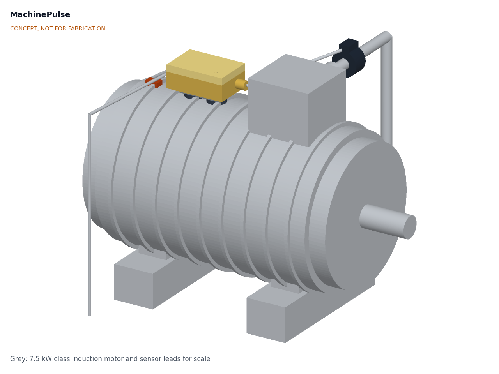

# MachinePulse

  

**Area:** Automation · **TRL:** 2 of 9 (concept formulated) · **Prototype budget:** about $80 USD · **Difficulty:** 2 of 5

A clip-on monitor for older machines: current clamp, vibration and temperature sensors report run time, load and early fault signs from lathes, pumps and compressors that have no electronics of their own.

[Interactive 3D model](media/viewer.html) · [Concept blueprint (PDF)](media/concept-blueprint.pdf) · [Review note](docs/REVIEW.md)

## Concept rationale

Retrofitting is how most of the world's machines will ever become connected. A lathe, pump or compressor that has run for 30 years can run for many more, but it has no sensors and no controller to read. MachinePulse adds the three measurements that say most about an induction-motor-driven machine: current (is it running, and how hard), vibration (is anything loosening or wearing) and frame temperature (is it working harder than it should). It compares each machine with its own first week of running rather than with fixed alarm levels, because old machines differ too much for generic limits.

It is open and garage-buildable because the owners who most need it run small shops without a maintenance engineer or a budget for vendor platforms. Every part is a stock module, a stock box or a block of aluminium cut with hand tools, the pod never touches the machine's wiring or controls, and the data goes to the lab's TwinKit gateway or any MQTT broker on the shop network, so an owner can inspect and change every step.

## Burning platform

Unplanned stops are expensive, and reactive maintenance makes them more likely. A NIST study of US discrete manufacturing estimated $119.1 billion of losses in 2016 from inadequate maintenance, and found that establishments relying most on reactive maintenance had 3.3 times more downtime and 16 times more defects than those relying on it least ([Thomas and Weiss, NIST, 2020](https://nvlpubs.nist.gov/nistpubs/ams/NIST.AMS.100-34.pdf)). Electric motor-driven systems, the machines MachinePulse watches, account for more than 40 % of global electricity consumption ([IEA](https://www.iea.org/reports/energy-efficiency-policy-opportunities-for-electric-motor-driven-systems)), so knowing when they run and how hard also matters for energy use.

The firms with the least monitoring are the most numerous. Small and medium enterprises are about 90 % of businesses and more than half of employment worldwide ([World Bank](https://www.worldbank.org/en/topic/smefinance)). Condition monitoring products are built and priced for large plants; a monitor at about $80 per machine brings the same early warning within reach of a small shop.

## Where it could be used

### By industry

| Industry | Use |
| --- | --- |
| Machine shops and job shops | Run hours and load on lathes, mills and drills; spot a worn spindle bearing or loose belt before it fails |
| Food, grain and rice processing | Watch mills, mixers, conveyors and refrigeration compressors that run long shifts |
| Water and irrigation | Pump run time, load and vibration at borewells, booster stations and irrigation pumps |
| Textiles and garments | Utilization and fault signs on looms, spinning frames and compressors |
| Building services | Fans, air handling units, chillers and pumps in older buildings without a management system |
| Makerspaces, schools and universities | Utilization of shared machines and a hands-on teaching tool for condition monitoring |

### By country or region

| Country or region | Why it matters there |
| --- | --- |
| India | About 63.4 million unincorporated micro, small and medium enterprises employing about 111 million people in the 2015 to 2016 survey ([PIB, Ministry of MSME](https://www.pib.gov.in/Pressreleaseshare.aspx?PRID=1555596)); most run older machines with no monitoring |
| Sub-Saharan Africa | The IEA calls reliability of power supply "a major problem in Africa" and expects electric irrigation pumps to replace diesel ([IEA Africa Energy Outlook 2022](https://www.iea.org/reports/africa-energy-outlook-2022/key-findings)); poor supply stresses motors, so early fault signs matter |
| Latin America and the Caribbean | Micro, small and medium firms are 99 % of the industrial fabric but have much lower productivity than large firms ([ECLAC](https://www.cepal.org/en/topics/micro-small-and-medium-sized-enterprises-msmes)) |
| European Union | 99 % of the 32.3 million enterprises are micro or small ([Eurostat, 2024](https://ec.europa.eu/eurostat/web/products-eurostat-news/w/ddn-20241025-1)); many run long-lived machine tools that predate connected equipment |
| United States | More than 98 % of the roughly 244,000 manufacturers employ fewer than 500 people, and about 74 % fewer than 20 ([ITIF, citing NAM](https://itif.org/publications/2025/06/17/mep-program-critical-for-small-manufacturers-underpinning-america-s-manufacturing-revival/)) |

## What sparked the idea

It came out of a September 2026 review of Design Molecule's applied research areas against the open projects already in the lab. It extends automation into industrial monitoring and feeds TwinKit. The practical trigger was that low-cost MEMS accelerometers made for vibration monitoring, such as ST's IIS3DWB, now offer a flat response from dc to 6 kHz ([ST](https://www.st.com/en/mems-and-sensors/iis3dwb.html)), while NIST's work shows how much reactive maintenance still costs manufacturers ([NIST, 2020](https://nvlpubs.nist.gov/nistpubs/ams/NIST.AMS.100-34.pdf)).

## Problem

Small factories run machines that have no monitoring, so breakdowns arrive without warning and utilization is unknown.

Full problem statement: [docs/01-problem.md](docs/01-problem.md)

## Concept

A magnetic pod on the motor frame carries a wideband accelerometer on an aluminium sensor block, an ESP32-S3 controller and an interface board. A split-core current transformer on one phase conductor and a stainless temperature probe near a bearing plug into it. Every minute the pod reports run state, run time, load current, vibration velocity (10 to 1,000 Hz) and frame temperature over Wi-Fi to a TwinKit gateway or any MQTT broker, and every 15 minutes it sends a spectrum. First-order estimates: about 0.35 kg, about 0.5 W from a 5 V adapter, about 0.4 MB of data per day and about $79 in parts, within the $80 budget. Not yet met: energy accuracy with one current clamp, fitting the clamp without opening a live enclosure on many machines, and frames hotter than about 60 °C (see the review note).

Full design precis: [docs/02-concept.md](docs/02-concept.md) · Requirements: [docs/03-requirements.md](docs/03-requirements.md)

## Key components

- Split-core current transformer, voltage output (SCT-013 family), on one phase
- Wideband MEMS vibration accelerometer (IIS3DWB class) on an aluminium sensor block
- DS18B20 surface temperature probe in a magnetic clip
- ESP32-S3 controller with Wi-Fi (LoRaWAN variant via FieldNode possible)
- IP54 enclosure on two 32 mm pot magnets, with steel pads for aluminium frames
- Certified 5 V USB power adapter
- TwinKit gateway or any MQTT broker (not in the BOM)

The working bill of materials is in [bom/bom.csv](bom/bom.csv).

## Safety

> Install current clamps only on insulated conductors with the machine isolated; opening electrical cabinets is for qualified people. Use only voltage-output clamps. Fit the pod and probe only with the machine stopped, keep leads clear of belts, shafts and chucks, and beware of hot frames and strong magnets. MachinePulse is a monitoring aid, never a protective device, and must not be wired into machine controls.

## Repository layout

| Folder | Contents |
| --- | --- |
| `docs/` | Problem, concept, requirements, calculations and design decisions |
| `cad/src/` | build123d Python source, the source of truth for all geometry |
| `cad/step/`, `cad/stl/` | Exported models for FreeCAD, other CAD tools and printing |
| `cad/drawings/` | 2D sketches and dimensioned drawings |
| `bom/` | Bill of materials |
| `electronics/` | KiCad schematics and PCB layouts |
| `firmware/` | Microcontroller code |
| `media/` | Renders, perspectives and photos |
| `build-log/` | Dated prototyping notes |

## Documentation

Controlled documents follow the portfolio [documentation standard](.kit/STANDARDS.md). Each carries a document ID (MPL-PRC-001 for the precis), a version and a revision history. Branded PDFs are built with `python .kit/render.py` and attached to GitHub Releases when a document is tagged, for example `MPL-PRC-001/v1.0`.

## Licenses

- **Hardware** (CAD, drawings, BOM, electronics): [CERN-OHL-S v2](LICENSE)
- **Software** (firmware, scripts, notebooks): [MIT](LICENSE-SOFTWARE)

A project of the [Design Molecule](https://designmolecule.com) lab. Extending strong areas set.
