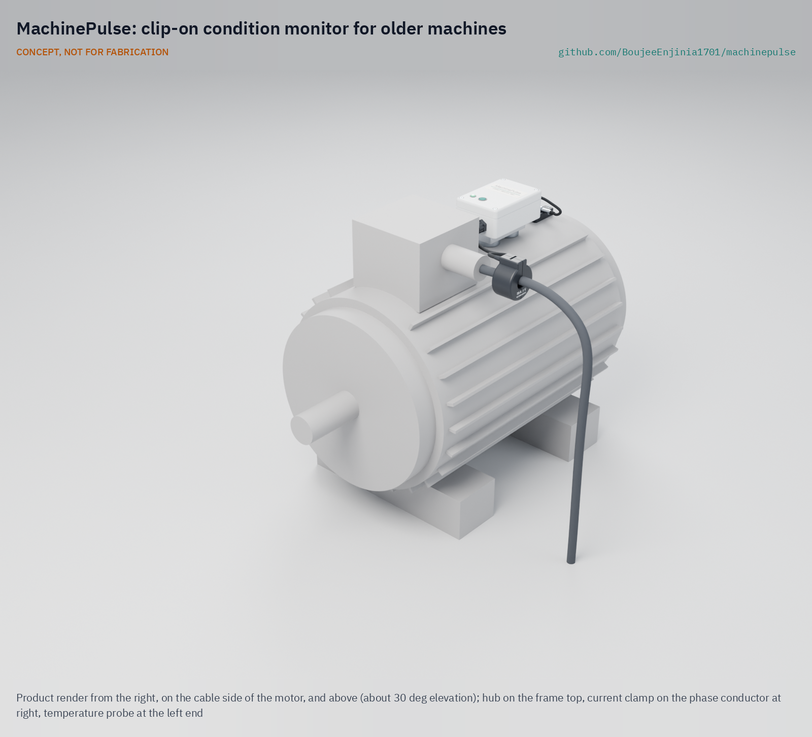
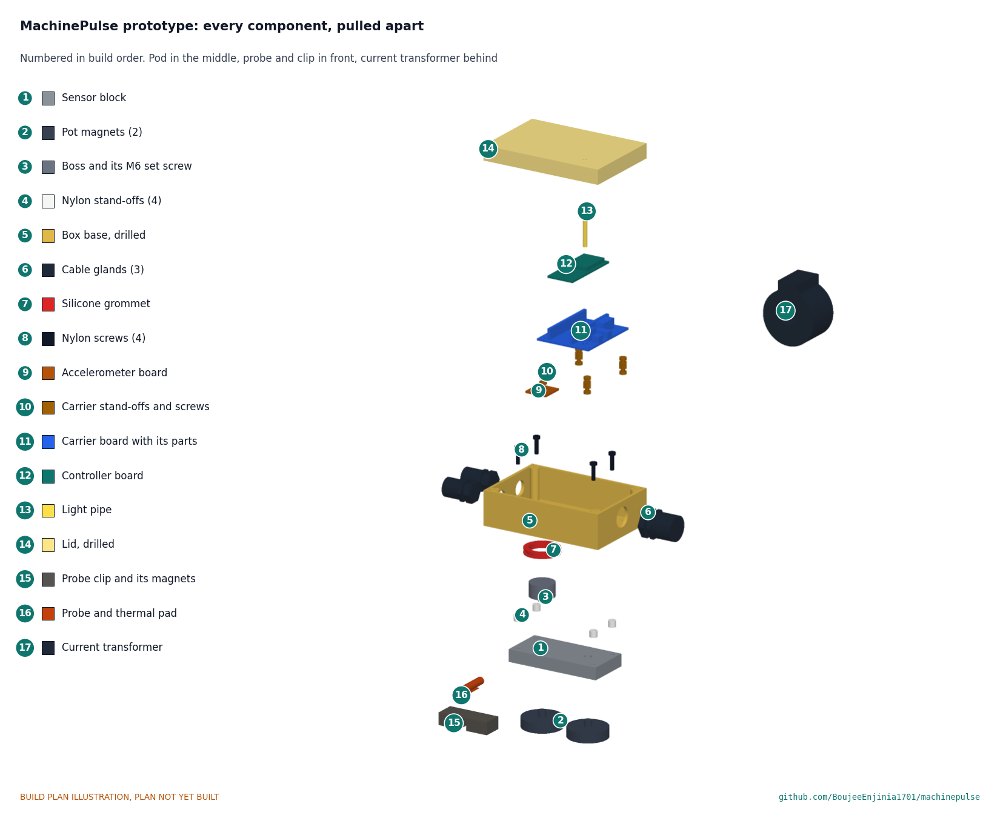

# MachinePulse

     

**Area:** Automation · **TRL:** 3 of 9 (proof of concept on paper) · **Value-engineering target:** USD 81 (estimated cost USD 83.50) · **Difficulty:** 2 of 5

A clip-on monitor for older machines: current clamp, vibration and temperature sensors report run time, load and early fault signs from lathes, pumps and compressors that have no electronics of their own.

[Exploded render](media/render-exploded.png) · [Detail render](media/render-detail.png) · [Interactive 3D model](media/viewer.html) · [Concept blueprint (PDF)](media/concept-blueprint.pdf) · [General arrangement MPL-DWG-001 (PDF)](cad/drawings/MPL-DWG-001.pdf) · [Calculations MPL-CAL-001](docs/04-calcs/01-sizing.md) · [Prototype build plan](docs/05-build-plan.md) · [Design decisions](docs/06-design-decisions.md) · [Review note](docs/REVIEW.md)

## Concept rationale

Retrofitting is how most of the world's machines will ever become connected. A lathe, pump or compressor that has run for 30 years can run for many more, but it has no sensors and no controller to read. MachinePulse adds the three measurements that say most about an induction-motor-driven machine: current (is it running, and how hard), vibration (is anything loosening or wearing) and frame temperature (is it working harder than it should). It compares each machine with its own first week of running rather than with fixed alarm levels, because old machines differ too much for generic limits.

It is open and garage-buildable because the owners who most need it run small shops without a maintenance engineer or a budget for vendor platforms. Every part is a stock module, a stock box or a block of aluminium cut with hand tools, the pod never touches the machine's wiring or controls, and the data goes to the lab's TwinKit gateway or any MQTT broker on the shop network, so an owner can inspect and change every step.

## Burning platform

Unplanned stops are expensive, and reactive maintenance makes them more likely. A NIST study of US discrete manufacturing estimated $119.1 billion of losses in 2016 from inadequate maintenance, and found that establishments relying most on reactive maintenance had 3.3 times more downtime and 16 times more defects than those relying on it least ([Thomas and Weiss, NIST, 2020](https://nvlpubs.nist.gov/nistpubs/ams/NIST.AMS.100-34.pdf)). Electric motor-driven systems, the machines MachinePulse watches, account for more than 40 % of global electricity consumption ([IEA](https://www.iea.org/reports/energy-efficiency-policy-opportunities-for-electric-motor-driven-systems)), so knowing when they run and how hard also matters for energy use.

The firms with the least monitoring are the most numerous. Small and medium enterprises are about 90 % of businesses and more than half of employment worldwide ([World Bank](https://www.worldbank.org/en/topic/smefinance)). Condition monitoring products are built and priced for large plants; a monitor costed at about $84 in parts per machine brings the same early warning within reach of a small shop.

## Where it could be used

### By industry

| Industry | Use |
| --- | --- |
| Machine shops and job shops | Run hours and load on lathes, mills and drills; spot a worn spindle bearing or loose belt before it fails |
| Food, grain and rice processing | Watch mills, mixers, conveyors and refrigeration compressors that run long shifts |
| Water and irrigation | Pump run time, load and vibration at borewells, booster stations and irrigation pumps |
| Textiles and garments | Utilization and fault signs on looms, spinning frames and compressors |
| Building services | Fans, air handling units, chillers and pumps in older buildings without a management system |
| Makerspaces, schools and universities | Utilization of shared machines and a hands-on teaching tool for condition monitoring |

### By country or region

| Country or region | Why it matters there |
| --- | --- |
| India | About 63.4 million unincorporated micro, small and medium enterprises employing about 111 million people in the 2015 to 2016 survey ([PIB, Ministry of MSME](https://www.pib.gov.in/Pressreleaseshare.aspx?PRID=1555596)); firms of that size are the ones MachinePulse is costed for |
| Sub-Saharan Africa | The IEA calls reliability of power supply "a major problem in Africa" and expects electric irrigation pumps to replace diesel ([IEA Africa Energy Outlook 2022](https://www.iea.org/reports/africa-energy-outlook-2022/key-findings)); poor supply stresses motors, so early fault signs matter |
| Latin America and the Caribbean | Micro, small and medium firms are 99 % of the industrial fabric but have much lower productivity than large firms ([ECLAC](https://www.cepal.org/en/topics/micro-small-and-medium-sized-enterprises-msmes)) |
| European Union | 99 % of the 32.3 million enterprises are micro or small ([Eurostat, 2024](https://ec.europa.eu/eurostat/web/products-eurostat-news/w/ddn-20241025-1)); a low-cost retrofit suits firms of that size |
| United States | Small firms are 98 % of manufacturers ([SBA Office of Advocacy, 2025](https://advocacy.sba.gov/2025/03/10/facts-about-small-business-manufacturing-statistics-2025/)); of 239,265 manufacturing firms in 2022, all but 4,177 had fewer than 500 employees and about three-quarters had fewer than 20 ([NAM, citing Census Bureau Statistics of U.S. Businesses](https://nam.org/mfgdata/facts-about-manufacturing-expanded/)) |

## What sparked the idea

The idea traces back to a loom. In 1924 Sakichi Toyoda completed the Type G automatic loom, which carried weft-break and warp-break auto-stop devices so that a fault halted the machine instead of spoiling cloth, and which Platt Brothers engineers called "the magic loom" ([Toyota Industries](https://www.toyota-industries.com/company/history/toyoda_sakichi/)). Stopping a machine when something is irregular became the origin of jidoka in the Toyota Production System ([Toyota](https://www.toyota-global.com/company/history_of_toyota/75years/text/taking_on_the_automotive_business/chapter1/section1/item4.html)): a machine that makes its own abnormality visible, so one person can look after many. Most lathes, pumps and compressors in small shops never gained that sense. MachinePulse gives it back to them from the outside, with one difference: it never touches the controls, and only tells a person that a machine has changed so that they can decide what to do.

## Problem

Small factories run machines that have no monitoring, so breakdowns arrive without warning and utilization is unknown.

Full problem statement: [docs/01-problem.md](docs/01-problem.md)

## Concept

A magnetic pod on the motor frame carries a wideband accelerometer on an aluminium sensor block, an ESP32-S3 controller plugged into a hand-wired carrier board, with the plastic box standing clear of the block on nylon stand-offs. A split-core current transformer on one phase conductor and a stainless temperature probe near a bearing plug into it. Every minute the pod reports run state, run time, load current, vibration velocity (10 to 1,000 Hz) and frame temperature over Wi-Fi to a TwinKit gateway or any MQTT broker, and every 15 minutes it sends a spectrum. The TRL 3 calculations (MPL-CAL-001) give a pod of 100 x 68 x 63 mm and about 0.32 kg, 0.42 W from a 5 V adapter, about 1.15 MB of data per day and a vibration noise floor of 0.037 mm/s. Value-engineering target: USD 81. Estimated cost of the constructable design: USD 83.50 (USD 2.50 over the target). High-temperature magnets rated 120 °C let the pod work on frames up to about 110 °C. Not met: fitting the clamp without opening a live enclosure on many machines. At risk: current accuracy at the bottom of the clamp's range, energy per shift, and the magnet mount's resonance near the top of the vibration band (see the review note).

Full design precis: [docs/02-concept.md](docs/02-concept.md) · Requirements: [docs/03-requirements.md](docs/03-requirements.md)

## Key components

- Split-core current transformer, voltage output (SCT-013 family, 5 to 60 A), on one phase
- Wideband MEMS vibration accelerometer (IIS3DWB class) on an aluminium sensor block
- DS18B20 surface temperature probe held on its thermal pad by a made aluminium clip with two high-temperature magnets
- ESP32-S3 controller with Wi-Fi (LoRaWAN variant via FieldNode possible)
- IP54 enclosure on nylon stand-offs over the sensor block, two 32 mm high-temperature pot magnets (rated 120 °C), steel pads for aluminium frames
- Certified 5 V USB power adapter
- TwinKit gateway or any MQTT broker (not in the BOM)

The priced bill of materials is in [bom/bom.csv](bom/bom.csv); the parametric model is `cad/src/model.py`, with STEP files in `cad/step/`.

## Building the prototype

The [prototype build plan](docs/05-build-plan.md) shows how to make and fit each of the 17 components, in order, with a making sketch for every made part, close-ups of the joints and a picture for every assembly step. The work is drilling and tapping aluminium plate and bar, drilling a stock box, and hand-wiring a perfboard; every other part is bought. Writing the plan made the design buildable: the boss became a separate piece screwed to the block, the box gained a third gland and a grommet, the boards sit on one carrier on stand-offs, and the probe got a made clip that holds it on the frame (decision record MPL-DDR-003). Decisions still open are in the [design decisions register](docs/06-design-decisions.md). It is a plan, not yet built.

## Safety

> Install current clamps only on insulated conductors with the machine isolated; opening electrical cabinets is for qualified people. Use only voltage-output clamps. Fit the pod and probe only with the machine stopped, keep leads clear of belts, shafts and chucks, and beware of hot frames and strong magnets. MachinePulse is a monitoring aid, never a protective device, and must not be wired into machine controls.

## Repository layout

| Folder | Contents |
| --- | --- |
| `docs/` | Problem, concept, requirements, calculations and design decisions |
| `cad/src/` | build123d Python source, the source of truth for all geometry |
| `cad/step/`, `cad/stl/` | Exported models for FreeCAD, other CAD tools and printing |
| `cad/drawings/` | 2D sketches and dimensioned drawings |
| `bom/` | Bill of materials |
| `electronics/` | KiCad schematics and PCB layouts |
| `firmware/` | Microcontroller code |
| `media/` | Renders, perspectives and photos |
| `build-log/` | Dated prototyping notes |

## Documentation

Controlled documents follow the portfolio [documentation standard](.kit/STANDARDS.md). Each carries a document ID (MPL-PRC-001 for the precis), a version and a revision history. Branded PDFs are built with `python .kit/render.py` and attached to GitHub Releases when a document is tagged, for example `MPL-PRC-001/v1.0`.

## Credits

Designed by Amish Chadha. See [CONTRIBUTORS.md](CONTRIBUTORS.md) for roles. To cite this design, use [CITATION.cff](CITATION.cff) (GitHub shows it as "Cite this repository").

AI assistance (Claude) was used to accelerate concept renders, prototype documentation and first-pass sizing calculations. Design direction and all decisions are Amish Chadha's, recorded in this repository's decision records (`docs/decisions/`).

## Licenses

- **Hardware** (CAD, drawings, BOM, electronics): [CERN-OHL-S v2](LICENSE)
- **Software** (firmware, scripts, notebooks): [MIT](LICENSE-SOFTWARE)

A project of the [Design Molecule](https://designmolecule.com) lab.
