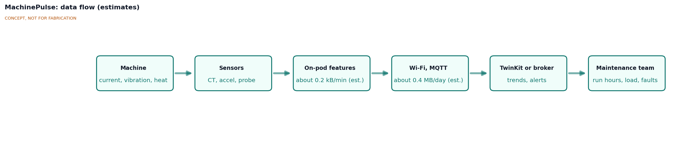
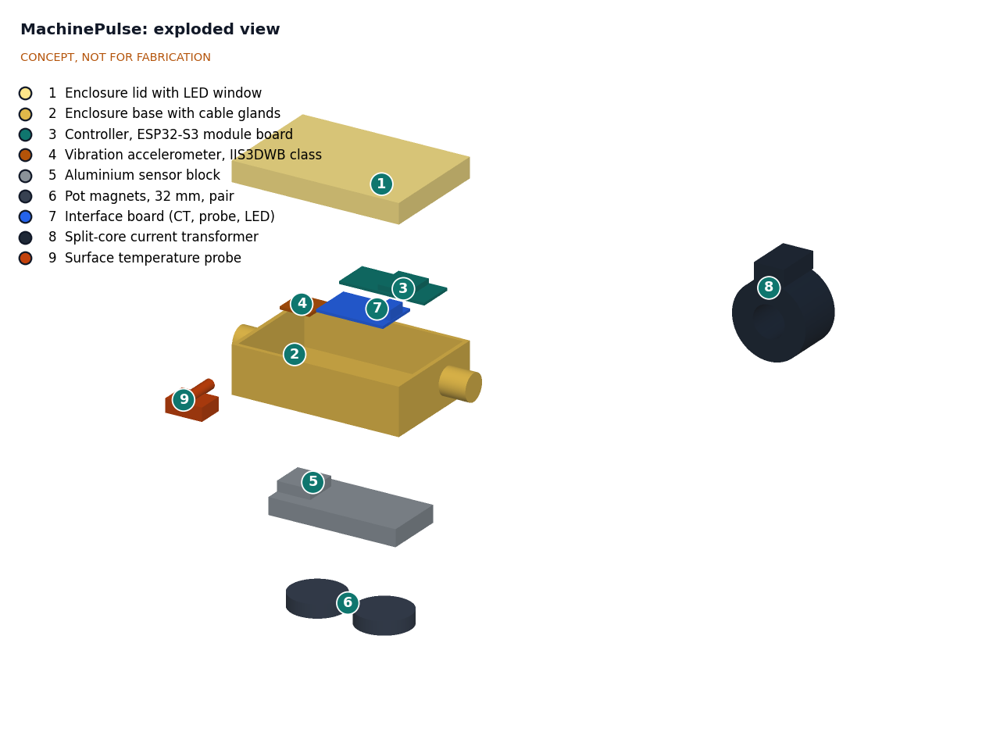
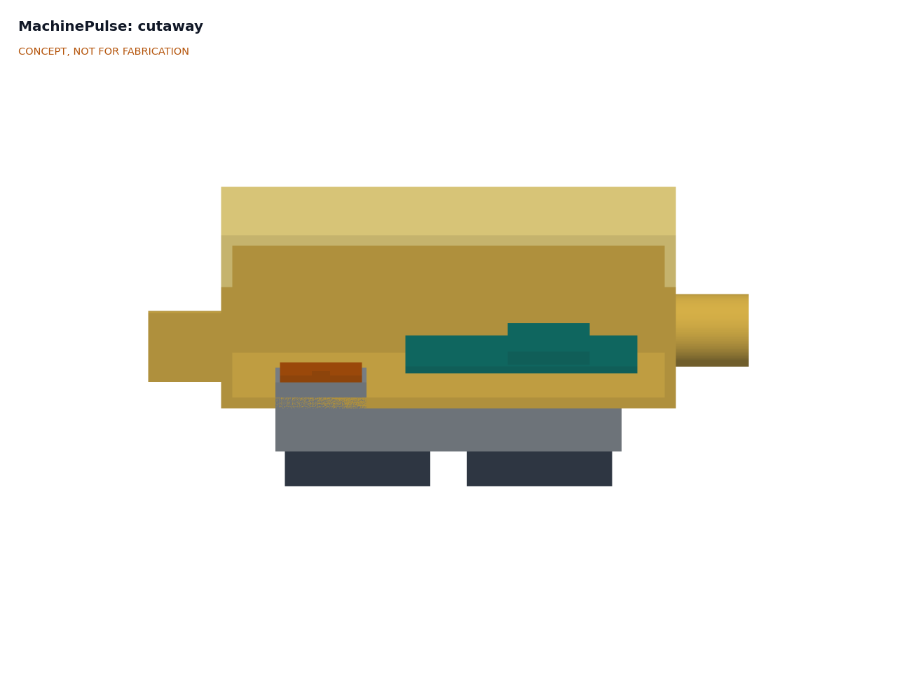

# MachinePulse design precis

## Summary

MachinePulse is a small magnetic pod that clips onto an old machine's motor frame, plus a split-core current transformer (CT) on one phase conductor and a surface temperature probe. Every minute it reports run state, run time, load current, vibration velocity and frame temperature to a TwinKit gateway or any MQTT broker on the shop network, and every 15 minutes it sends a vibration spectrum. First-order numbers suggest that stock modules and a hand-made aluminium sensor block meet most requirements for about $79 in parts. Three requirements are not met: energy accuracy with one CT (R4), installation without opening live enclosures on many machines (R10), and hot frames above about 60 °C (R12).

Figure 1. MachinePulse on a 7.5 kW class induction motor (grey, for scale). Massing model; concept, not for fabrication.

## How it works

1. **Sense current.** A voltage-output split-core CT (YHDC SCT-013 family) clamps one insulated phase conductor. The pod samples it at 2 kHz and computes RMS current every second.
2. **Sense vibration.** A wideband MEMS accelerometer (IIS3DWB class, dc to 6 kHz, 75 µg/√Hz noise density, 1.1 mA ([ST](https://www.st.com/en/mems-and-sensors/iis3dwb.html))) sits on the boss of an aluminium sensor block. Two pot magnets under the block pull it onto the machine frame, so vibration reaches the sensor through metal, not through the plastic box.
3. **Sense temperature.** A DS18B20 probe in a stainless sleeve sits in a small magnetic clip on the frame near a bearing.
4. **Summarize on the pod.** Every 60 s the ESP32-S3 controller records a 4 s vibration burst, decimates it to 3.33 kHz, and computes velocity RMS over 10 to 1,000 Hz (the ISO 20816-1 band ([ISO](https://www.iso.org/standard/63180.html))), acceleration RMS, crest factor and the amplitudes at 1x and 2x running speed. It adds run state, run seconds, mean and peak current, starts, and temperature.
5. **Send and store.** The summary goes over Wi-Fi to an MQTT broker, by default on the TwinKit gateway. If the network is down, summaries queue in flash for about 10 days.
6. **Compare with the machine's own baseline.** During the first week of running, the gateway software learns a baseline per load band. Afterward it flags a change, for example vibration velocity above twice its baseline or temperature rise above baseline at the same load, for a person to inspect.

Figure 2. Data flow from machine to maintenance team. Values are estimates.

## Main components

Table 1. Main components. Numbers match the BOM and Figure 3.

| # | Component | Proposed choice | Notes |
| --- | --- | --- | --- |
| 1, 2 | Enclosure | Stock IP54 ABS box, about 100 x 68 x 40 mm, two M12 IP68 cable glands, LED window | Stock box keeps cost low; printed alternative in the review note |
| 3 | Controller | ESP32-S3 module board, 8 MB flash, USB-C, Wi-Fi and BLE | Radio choice proposed, awaiting Amish |
| 4 | Accelerometer | IIS3DWB-class 3-axis MEMS on a breakout | Fallback ADXL345 class, cheaper and noisier |
| 5 | Sensor block | 76 x 36 x 10 mm aluminium with a 20 x 20 mm boss through the box floor | Carries magnets and sensor; stiff path to the frame |
| 6 | Magnets | Two 32 mm neodymium pot magnets with M6 studs | Steel adhesive pads (BOM line 11) for aluminium frames |
| 7 | Interface board | Perfboard with CT bias and filter, 3.5 mm jack, probe connector, LED, button | No custom PCB for the first build |
| 8 | Current transformer | SCT-013 family, voltage output, range per machine (for example 30 A) | Voltage output has an internal burden, so it is never open-circuited |
| 9 | Temperature probe | DS18B20 in stainless sleeve, magnetic clip, thermal pad | |
| 10 | Power | Certified 5 V 1 A USB-C adapter and 2 m cable | Low voltage only in the pod |

Figure 3. Exploded view with BOM numbers.

Figure 4. Cutaway through the accelerometer: the sensor sits on the aluminium block, which sits on the magnets, so the plastic box carries no vibration path.

## First-order numbers

All values are estimates for concept review and will be checked at TRL 3.

Table 2. First-order numbers.

| Quantity | Estimate | Basis and assumptions | Requirement |
| --- | --- | --- | --- |
| Example full-load current | about 14.6 A | 7.5 kW motor, 400 V three-phase, efficiency 0.88, power factor 0.84 (typical values, assumed) | Sizes the CT: 30 A range, full load at about half range |
| Current sampling | 2 kHz, 40 samples per 50 Hz cycle | ESP32-S3 ADC | R1, R3 |
| Current accuracy | about 3 % of reading, 10 % to 100 % of range | Two-point calibration; ADC nonlinearity is the main error | R3 met |
| Energy accuracy | about 20 % | One phase, assumed voltage and power factor, balanced phases | R4 **not met** |
| Vibration band | 10 to 1,000 Hz | 4 s burst decimated to 3.33 kHz | R5 met |
| Spectrum resolution | 0.41 Hz | 8,192-point FFT at 3.33 kHz; 1x at 1,450 rpm is 24.2 Hz | R7 met |
| Velocity noise floor | about 0.04 mm/s RMS | 75 µg/√Hz integrated as velocity over 10 to 1,000 Hz; mount effects not included | R6 met on datasheet |
| Magnet mount | usable to about 2 kHz (estimate) | Typical for flat magnetic mounts on a clean surface; to be checked | R5 |
| Pod mass | about 0.35 kg | Box and glands 125 g, block 80 g, magnets 100 g, electronics and leads 45 g | |
| Magnet holding margin | about 6 times | Assumes about 100 N total pull on a painted, curved cast frame (20 % of flat-steel rating) against 0.35 kg at 5 g (about 17 N) | R11 unverified |
| Power | about 0.5 W from 5 V (about 4.4 kWh per year) | Wi-Fi with modem sleep about 80 mA at 3.3 V, sensors about 5 mA, regulator losses | |
| Data volume | about 0.4 MB per day | 200 B summary per minute plus 1 kB spectrum every 15 min | R9 met |
| Offline store | about 10 days | 4 MB of the 8 MB flash reserved for the queue | R15 met |
| Frame temperature limit | about 60 °C | ABS box and module on an aluminium block that runs near frame temperature | R12 **not met** for 80 °C |
| Parts cost | about $79 | Indicative prices, see `bom/bom.csv` | R16 met, thin margin |

## Key design choices

- **Stiff sensor path, plastic box for protection only.** The accelerometer sits on the aluminium block, and the block sits on the magnets. This is the cheapest way to get a usable vibration signal from a magnet-mounted pod.
- **Features on the pod, spectra on a slow schedule.** Summaries every minute and a spectrum every 15 minutes keep traffic near 0.4 MB a day, so one gateway can serve many machines. Raw bursts can be captured on demand for diagnosis. Proposed, awaiting Amish.
- **One CT on one phase.** Enough for run state, run hours and relative load, within budget. It is not an energy meter (R4). Three CTs is an option at about $20 more. Proposed: one CT, awaiting Amish.
- **Wi-Fi first.** Small workshops usually have Wi-Fi, and spectra are too large for a LoRaWAN duty cycle. A summaries-only LoRaWAN variant could reuse the FieldNode radio core later. Proposed, awaiting Amish.
- **Mains-powered adapter, no battery.** A certified 5 V adapter avoids lithium cells on a hot, vibrating frame. Proposed, awaiting Amish.
- **Baseline, not fixed limits.** Old machines differ too much for fixed alarm levels to be useful at first. Each machine is compared with its own first week, by load band, and flags go to a person. Proposed, awaiting Amish.
- **Data stays local.** MQTT to the TwinKit gateway, where the twin shows readings on the machine's model; any other broker works too.

## Relation to other lab projects

- **TwinKit** is the default data home: its gateway runs an MQTT broker, stores data offline and shows readings against a model. MachinePulse is a natural first "small manufacturing" twin for it.
- **FieldNode** provides a LoRaWAN radio core if a summaries-only variant is wanted for sites without Wi-Fi.
- **CalRig** can check the temperature probe against a reference before deployment. Vibration calibration needs a separate reference (a shaker or a known accelerometer) that CalRig does not provide.

## Safety

> **Safety:** Mains voltage. The CT goes around a live conductor. Fit it only with the machine isolated and locked off, only around a single insulated conductor, and have a qualified person open any terminal box or panel. Use only voltage-output CTs with an internal burden: a current-output CT left open-circuited on a live conductor can produce dangerous voltages ([OpenEnergyMonitor](https://docs.openenergymonitor.org/electricity-monitoring/ct-sensors/introduction.html)).

> **Safety:** Moving machinery. Fit and remove the pod and probe only when the machine is stopped and isolated. Mount on stationary frames, never on guards that open or on moving parts. Route leads away from belts, shafts, chucks and fans, and secure them with ties.

> **Safety:** Hot surfaces and magnets. Motor frames and compressor heads can be hot enough to burn. Strong neodymium magnets can pinch fingers and snap together; keep them away from pacemakers and magnetic media.

> **Safety:** Power supply. Use only a certified 5 V adapter with the local safety mark. The pod contains no mains wiring and no lithium cells.

MachinePulse is a monitoring aid. It is not a protective device, it must never be wired into machine controls, and it does not replace overload relays, guards or scheduled maintenance.

## Open questions for TRL 3

- Check the magnet mount: pull force on painted curved frames, and the usable frequency range with the block and two magnets.
- Error budget for current on the ESP32-S3 ADC, and whether an external ADC is needed.
- Frame temperature limit: a stand-off, insulating pad or higher-temperature enclosure for compressors and hot motors (R12).
- Whether a voltage reference or three CTs are worth the cost to meet R4. Proposed: no for the first build, awaiting Amish.
- Pilot site and first machines, awaiting Amish.

Concept media: [blueprint sheet](../media/concept-blueprint.pdf), [interactive 3D model](../media/viewer.html).
