# MachinePulse prototype build plan

**Plan, not yet built.** How to build the first proof-of-concept prototype, component by component. Building and testing to it is TRL 4 work. Decisions still to be made are kept in the design decisions register ([docs/06-design-decisions.md](06-design-decisions.md)), not here.

## 1. What you are building

*Figure 1. Every component pulled apart and numbered in build order: the pod in the middle, the probe and its clip in front, the current transformer to the right.*

The prototype is one MachinePulse kit for one machine: a small pod that holds onto the motor frame with two pot magnets, a temperature probe held on the frame by its own magnetic clip, and a split-core current transformer that closes round one insulated supply conductor. Inside the pod, an aluminium block carries the magnets and a short round boss; the vibration sensor is bonded to the top of the boss, and a stock plastic box stands 5 mm clear of the block on four nylon stand-offs, holding a hand-wired carrier board and the controller. Figure 1 shows the 17 components in the order you make or fit them. Four are made in a small workshop: the sensor block, the boss, the carrier board and the probe clip; the box base and lid are bought and drilled. Everything else is bought and fitted. The work is sawing, filing, drilling and tapping aluminium plate and bar, drilling a plastic box, soldering a perfboard and bonding two small parts with epoxy. The parts cost about USD 83.50 from the bill of materials.

> **Safety:** The current transformer goes round a conductor that carries mains voltage. It is fitted only with the machine isolated and locked off, only round a single insulated conductor, and any terminal box or panel is opened only by a qualified person (section 6). Use only voltage-output current transformers. Fit and remove the pod and probe only with the machine stopped. Motor frames can be hot enough to burn. The magnets are strong: they pinch fingers and snap together, and must be kept away from pacemakers and magnetic media. Epoxy and threadlocker need gloves and ventilation. The pod itself runs only on 5 V from a certified adapter.

## 2. What changed to make it buildable

The concept showed what the pod does; some of its parts could not be made with hand tools, had no fixing, or did not touch the parts they were meant to touch. Each change below keeps what the pod does, and all of them are recorded in decision record MPL-DDR-003, open for Amish's review.

*Table 1. Changes from the concept.*

| Component | The concept had | The buildable design has | Why |
| --- | --- | --- | --- |
| Sensor block and boss | One aluminium piece with a 20 mm boss standing 11 mm proud of a 10 mm plate | A drilled and tapped plate, and a separate boss cut from round bar, held by a set screw over the left magnet (Figure 3) | No lathe or mill needed; the stiff path from frame to sensor is kept |
| Magnets | Studs with no holes to go into | Studs trimmed to 5 mm and screwed into tapped holes in the block | A fixing you can make in a drill press |
| Nylon stand-offs | No screws; 0.6 mm from the floor hole and touching the boot | Moved 3 mm outward and 1 mm back; one nylon screw each, into the block (Figure 8) | A real fixing that stays a heat break, with room for the grommet |
| Boot round the boss | A loose ring floating under the floor | A stock silicone grommet in the floor hole, gripping the boss (Figure 5) | Seals the hole with a bought part |
| Boards | Two boards floating above the floor | One carrier perfboard on four stand-offs, with the controller plugged into sockets on it (Figure 11) | Module boards of this class have no mounting holes; one board is simpler to fix |
| Cable glands | Two glands with no holes or nuts; the probe and power leads sharing one | Three glands, one lead each, set high enough that their nuts clear the floor and corner pillars (Figure 9) | A single-hole seal cannot seal two leads, and a USB plug cannot pass a gland |
| Status light | A window in the lid with nothing behind it | A light pipe from the LED on the carrier up through the lid (Figure 14) | The light reaches the outside with the box sealed |
| Accelerometer | No fixing; too big to pass the floor hole | Bonded to the boss top after the box is fitted (step 5) | A rigid bond suits vibration sensing; the order follows from its size |
| Temperature probe | The sleeve resting on top of a clip, 7 mm above the frame | A made aluminium clip with two magnets that holds the sleeve down on its thermal pad (Figure 16) | The sleeve now touches the frame, as the temperature calculation assumes |

## 3. Making the components

Make and check each component before the assembly step that needs it. Sizes are in millimetres. "Left end" is the end of the box with the probe and power glands; "right end" has the current transformer gland; "front" is the long side nearest the status light. Sizes across the pod are measured from the box's centre lines. Workshop tolerance is 0.5 mm unless a step says otherwise; drawings carry no tolerances before TRL 4.

### 3.1 Sensor block

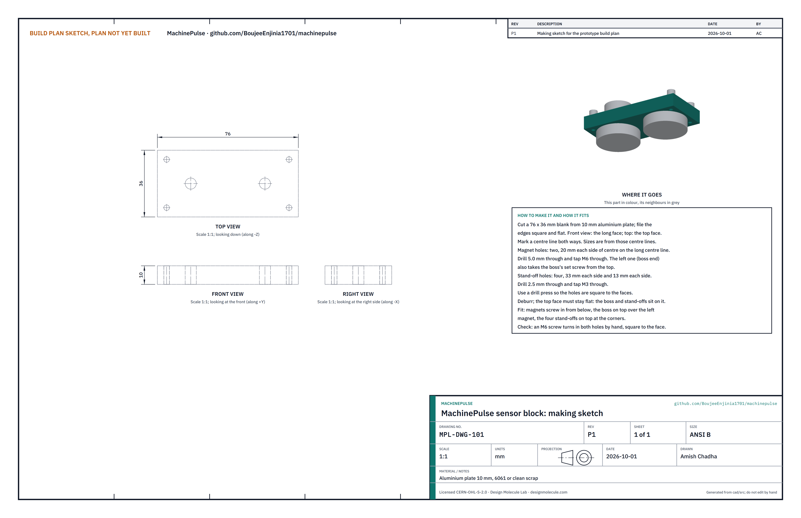

*Figure 2. Sensor block making sketch (MPL-DWG-101).*

**What it is and what it is made from.** The plate that the two magnets screw into and that carries the boss and the four nylon stand-offs. Aluminium plate 10 mm thick, 6061 class or clean scrap, cut to 76 x 36 mm.

**How to make it.**

1. Cut the blank to 76 x 36 mm and file the edges square. Keep the top face flat: the boss and stand-offs sit on it.
2. Scribe a centre line both ways.
3. Magnet holes: two, 20 mm each side of centre on the long centre line. Drill 5.0 mm right through and tap M6 right through. The left one also takes the boss's set screw from the top.
4. Stand-off holes: four, 33 mm each side of centre along the length and 13 mm each side across it. Drill 2.5 mm right through and tap M3.
5. Drill in a drill press so every hole is square to the faces. Deburr both faces.

**How it fits the parts next to it.**

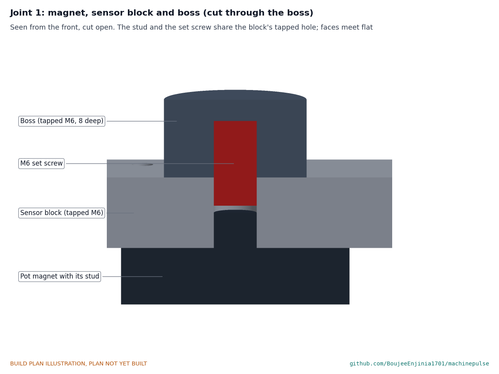

*Figure 3. The magnet's stud comes up into the left tapped hole from below; the set screw goes into the same hole from above and up into the boss. The boss face and the magnet back each sit flat on the block.*

The two magnets screw in from below with their backs flat on the underside. The boss sits flat on the top face over the left magnet. The four stand-offs sit on the top face at the corners, each held by a nylon screw that comes down through the box floor.

**Check before moving on.** An M6 screw turns into both holes by hand and stands square to the face; an M3 screw turns into all four small holes.

### 3.2 Boss

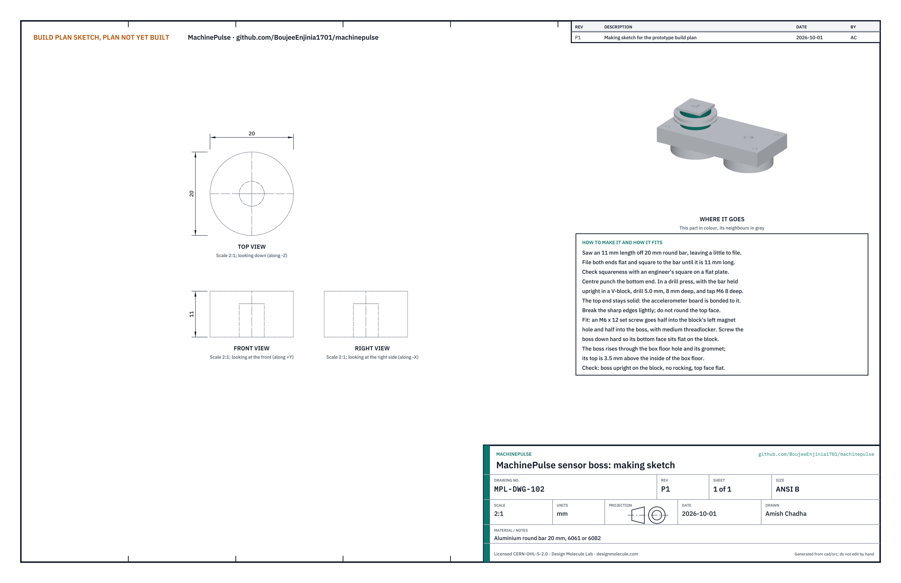

*Figure 4. Boss making sketch (MPL-DWG-102).*

**What it is and what it is made from.** A short round post that carries the vibration sensor up through the box floor, so that vibration reaches the sensor through metal and never through the plastic box. Aluminium round bar 20 mm, 6061 or 6082 class.

**How to make it.**

1. Saw a length a little over 11 mm off the bar.
2. File both ends flat and square to the bar until it is 11 mm long. Check against an engineer's square on a flat plate.
3. Centre punch the bottom end. With the bar held upright in a V-block in the drill press, drill 5.0 mm, 8 mm deep, and tap M6 8 mm deep.
4. Leave the top end solid and flat; break the sharp edges lightly.

**How it fits the parts next to it.** An M6 x 12 set screw with medium threadlocker goes half into the block's left tapped hole and half into the boss; screw the boss down until its bottom face sits flat on the block (Figure 3). Its top ends 3.5 mm above the inside of the box floor. It passes through the 24 mm floor hole without touching the floor; a silicone grommet in the hole grips it and seals the gap:

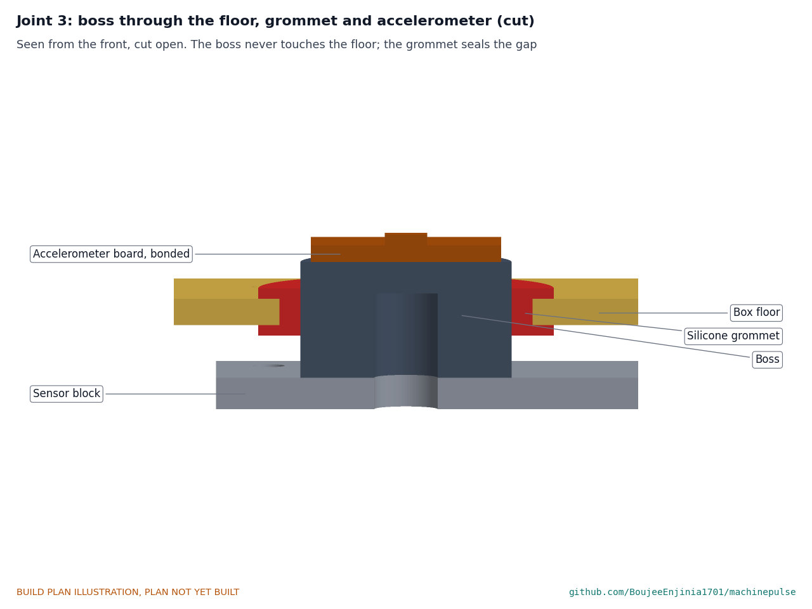

*Figure 5. The boss rises through the grommet; the accelerometer board is bonded to its top face, 2.5 mm above the grommet.*

**Check before moving on.** The boss stands upright on the block and does not rock; its top face is flat.

### 3.3 Box base, drilled, with its glands and grommet

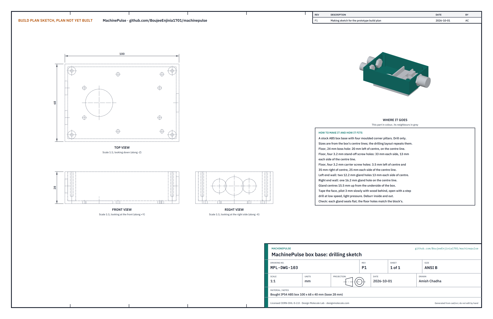

*Figure 6. Box base drilling sketch (MPL-DWG-103).*

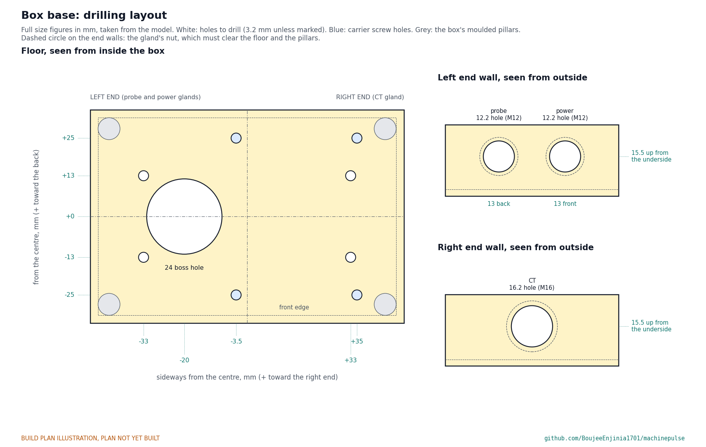

*Figure 7. Every hole, with full size figures from the box's centre lines, and the end walls seen from outside.*

**What it is and what it is made from.** The lower part of a bought IP54 ABS box, 100 x 68 mm and 28 mm deep (the whole box is 40 mm tall with its lid), with four moulded corner pillars for the lid screws. Eleven holes are drilled in it.

**How to make it.**

1. Cover the floor and both end walls with masking tape and mark the holes from Figure 7.
2. Floor: the 24 mm boss hole, 20 mm left of centre on the centre line; four 3.2 mm stand-off screw holes, 33 mm each side of centre and 13 mm each side of the centre line; four 3.2 mm carrier screw holes, 3.5 mm left of centre and 35 mm right of centre, 25 mm each side of the centre line.
3. Left end wall: two 12.2 mm gland holes, 13 mm each side of centre. Right end wall: one 16.2 mm gland hole on the centre line. All gland centres are 15.5 mm up from the underside of the box.
4. With a block of wood behind the face, pilot drill every hole 3 mm at low speed, then open the large ones with a step drill, light pressure. Check each gland hole against the gland's datasheet before the last step.
5. Deburr inside and out and peel the tape.

**How it fits the parts next to it.** The floor sits on the four nylon stand-offs, 5 mm above the sensor block; nothing else touches the block:

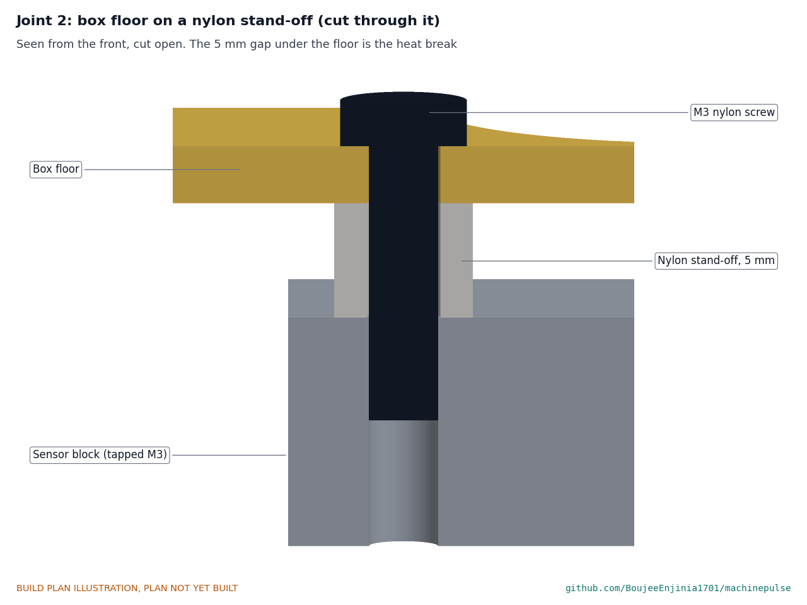

*Figure 8. Each stand-off sits between the block and the floor, held by one nylon screw from inside the box into the block's tapped hole.*

Each gland goes in from outside with its seal and body outside and its nut inside. The nuts clear the floor and the corner pillars:

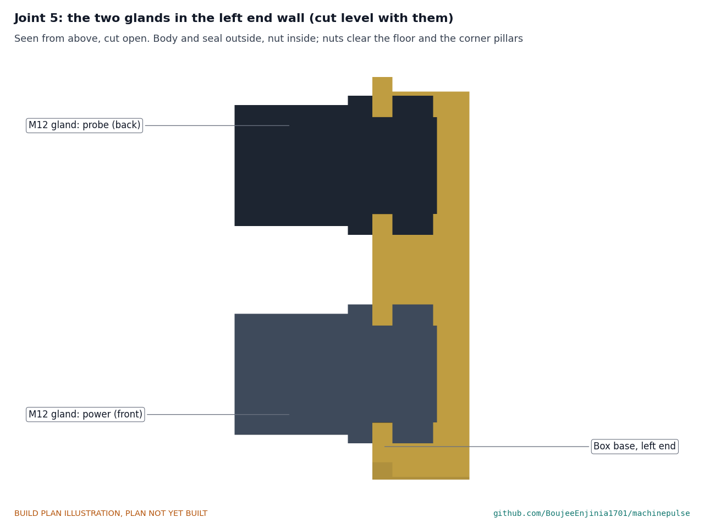

*Figure 9. The two M12 glands in the left end wall, seen from above and cut open: body outside, wall, nut inside.*

The grommet presses into the boss hole from below with one flange each side of the floor (Figure 5).

**Check before moving on.** Each gland seats flat on the wall and its nut turns down without touching a pillar; the floor's small holes line up with the block's when the two are laid together.

### 3.4 Carrier board

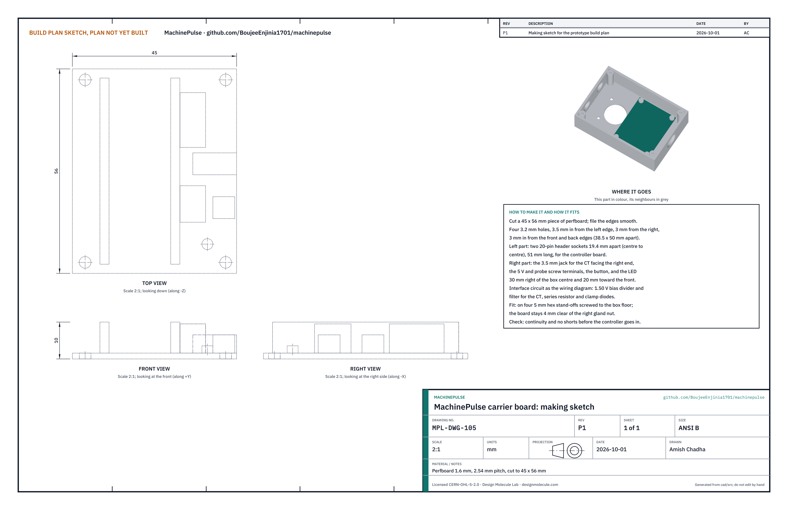

*Figure 10. Carrier board making sketch (MPL-DWG-105), with the sockets, jack, terminals, button and LED in place.*

**What it is and what it is made from.** The one board inside the box. It carries the interface circuit for the current transformer and the probe, the screw terminals the leads land on, the status LED and button, and two header sockets that the controller plugs into. Perfboard 1.6 mm thick with a 2.54 mm hole pitch, cut to 45 x 56 mm.

**How to make it.**

1. Cut the board to 45 x 56 mm and file the edges smooth.
2. Drill four 3.2 mm holes, 3.5 mm in from the left edge and 3 mm in from the right edge, 3 mm in from the front and back edges (38.5 x 50 mm apart).
3. On the left part, solder two 20-pin female header sockets, 51 mm long, 19.4 mm apart centre to centre, for the controller board.
4. On the right part, solder the 3.5 mm jack for the current transformer facing the right end, the 2-way 5 V terminal toward the front, the 3-way probe terminal toward the back, the push button, and the status LED 30 mm right of the box centre and 20 mm toward the front, so it sits under the lid's light pipe.
5. Build the interface circuit and wire the board as section 3.4.1 shows.

**How it fits the parts next to it.**

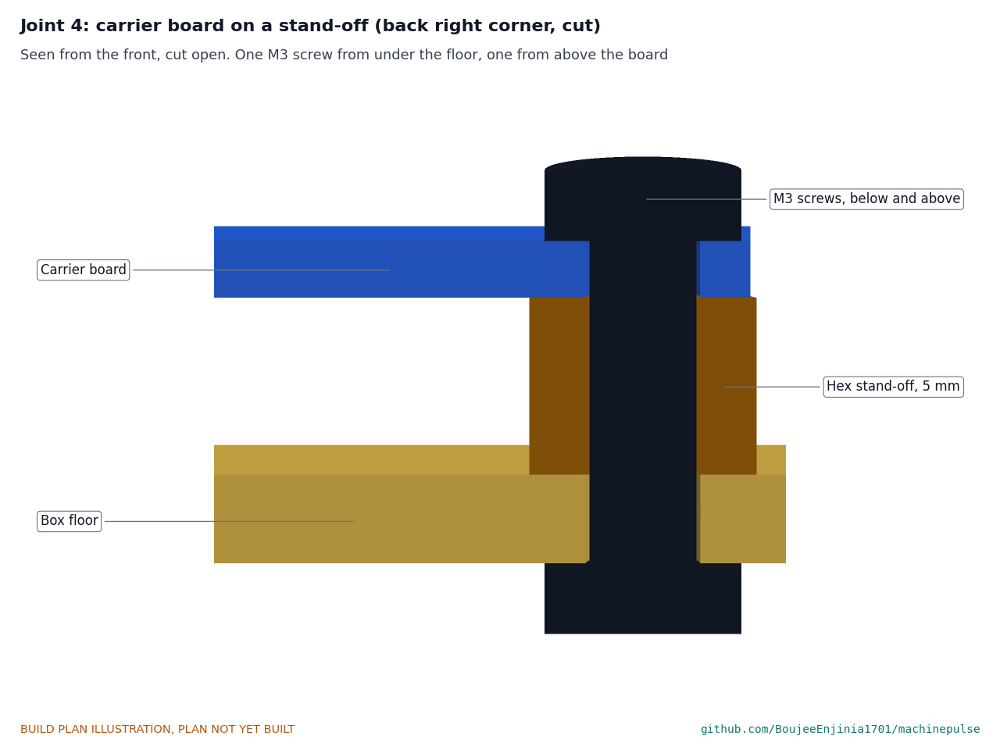

*Figure 11. Each corner sits on a 5 mm hex stand-off: one M3 screw comes up through the floor into the stand-off, one comes down through the board into it.*

The board sits 5 mm above the inside of the floor, 4 mm clear of the right gland's nut and 5 mm clear of the accelerometer. The controller board presses into the sockets with its aerial end toward the back of the box.

**Check before moving on.** Every joint continues end to end; with nothing plugged in there is no short between 5 V and ground.

#### 3.4.1 Wiring

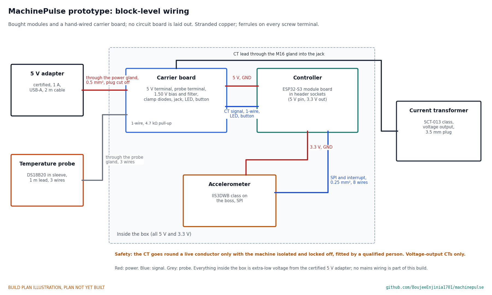

*Figure 12. Block-level wiring with wire sizes. No circuit board is laid out at this stage; the carrier is hand-wired perfboard.*

Wire it like this, with stranded copper and a ferrule on every screw terminal:

1. Power: cut the far plug off the adapter's USB cable, pass the cable through the front left gland, and land the red and black wires (0.5 mm²) on the 5 V terminal, red to 5 V. From the terminal, run 5 V and ground to the controller's 5 V and ground pins.
2. Controller to sensors: the controller's 3.3 V output and ground feed the accelerometer and the interface circuit.
3. Current transformer: a bias divider sets 1.50 V at the controller's analog input; the jack's signal passes through a series resistor and an RC filter to that input, with clamp diodes to 3.3 V and ground.
4. Probe: pass its lead through the back left gland and land its three wires on the probe terminal; a 4.7 kΩ pull-up runs from the data wire to 3.3 V, and the data wire goes to a controller pin.
5. Accelerometer: eight thin wires (0.25 mm²), twisted in pairs, from the board on the boss to the controller's SPI and interrupt pins, with enough slack that the box can lift 2 mm without pulling them.
6. LED and button: each to a controller pin, the LED through a resistor.
7. Current transformer lead: pass the plug through the right gland's seal and plug it into the jack.

**Check before moving on.** With the adapter unplugged, 5 V and ground read open to each other; every wire is labelled; no wire crosses the boss.

### 3.5 Lid, drilled, and light pipe

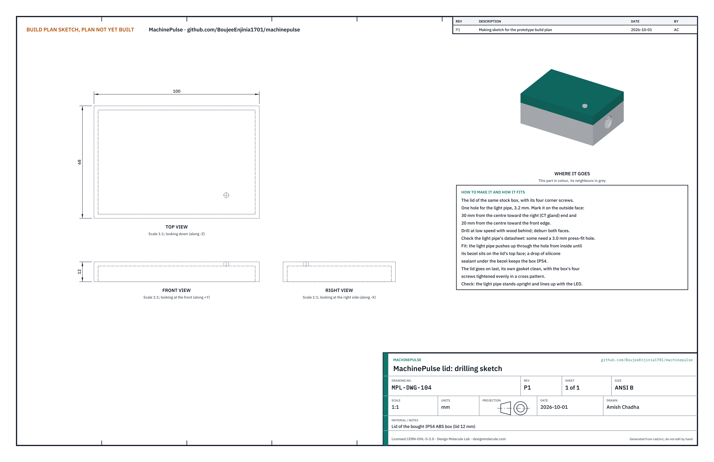

*Figure 13. Lid drilling sketch (MPL-DWG-104).*

**What it is and what it is made from.** The lid of the same stock box, 12 mm deep, with its gasket and four corner screws, drilled for the light pipe.

**How to make it.**

1. On the outside face, mark a point 30 mm from the centre toward the right end and 20 mm from the centre toward the front edge.
2. Drill 3.2 mm at low speed with wood behind, and deburr both faces. Check the light pipe's datasheet first: some need a 3.0 mm press-fit hole.

**How it fits the parts next to it.**

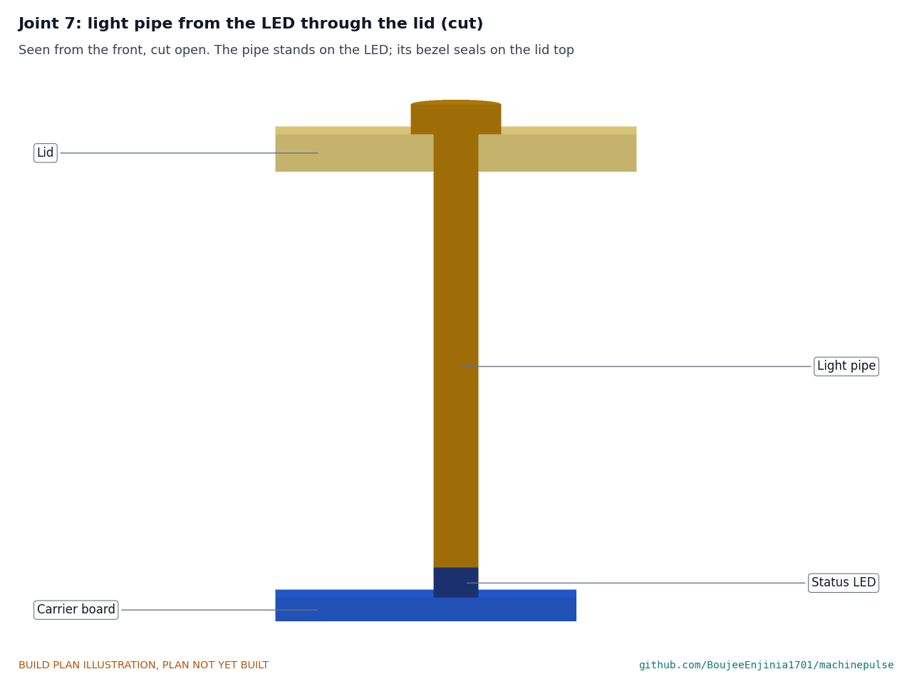

*Figure 14. The light pipe stands on the LED and passes up through the lid; its bezel sits on the lid's top face.*

The light pipe pushes up through the hole from inside until its bezel sits on the top face; a drop of silicone sealant under the bezel keeps the box sealed. The lid closes on its own gasket with the box's four screws.

**Check before moving on.** The light pipe stands upright and lines up with the LED when the lid is held in place.

### 3.6 Probe clip

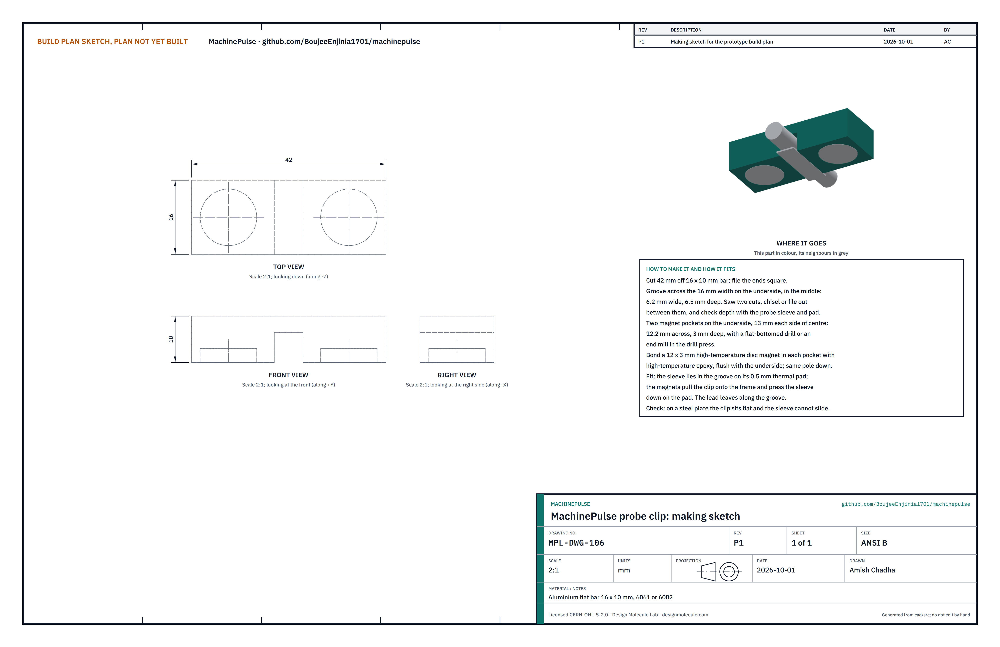

*Figure 15. Probe clip making sketch (MPL-DWG-106).*

**What it is and what it is made from.** A small magnetic block that holds the temperature probe's sleeve down on the frame near a bearing. Aluminium flat bar 16 x 10 mm, 6061 or 6082 class, with two 12 x 3 mm high-temperature neodymium disc magnets rated 150 °C or more.

**How to make it.**

1. Cut 42 mm off the bar and file the ends square.
2. On the underside, cut a groove across the 16 mm width in the middle, 6.2 mm wide and 6.5 mm deep: saw two cuts, then chisel or file out between them, checking the depth with the sleeve and pad.
3. On the underside, 13 mm each side of centre, make two flat-bottomed pockets 12.2 mm across and 3 mm deep, with a flat-bottomed drill or an end mill in the drill press.
4. Bond a magnet into each pocket with high-temperature epoxy, flush with the underside and with the same pole facing down (step 11).

**How it fits the parts next to it.**

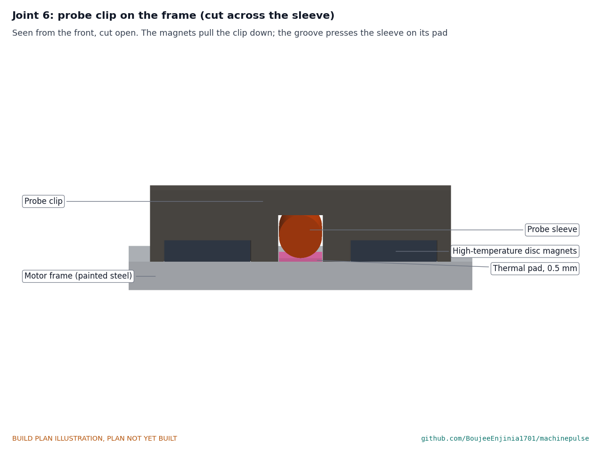

*Figure 16. The magnets pull the clip onto the frame; the groove holds the sleeve down on its 0.5 mm thermal pad.*

The sleeve lies in the groove on its thermal pad, its lead leaving along the groove. The magnets sit on the frame beside it and pull the clip down, so the groove presses the sleeve onto the pad and the pad onto the frame.

**Check before moving on.** On a flat steel plate the clip sits flat and the sleeve cannot be slid out by hand.

### 3.7 Bought components

Buy to specification, not brand. Line numbers are those of the bill of materials.

- **Box (lines 1 and 2).** IP54 ABS box 100 x 68 x 40 mm, base 28 mm and lid 12 mm, with four moulded corner pillars, a lid gasket and four lid screws, rated for continuous use at 70 °C or more. Drill as sections 3.3 and 3.5.
- **Cable glands (line 2).** One M16 x 1.5 nylon gland, IP68, for 4 to 8 mm cable, whose seal lets the current transformer's 3.5 mm plug through; two M12 x 1.5 nylon glands, IP68, for 3 to 6.5 mm cable.
- **Controller (line 3).** ESP32-S3 module board without octal PSRAM (the module rated to 85 °C), about 22 x 51 mm with two 20-pin rows 19.4 mm apart, USB-C, Wi-Fi.
- **Accelerometer (line 4).** IIS3DWB-class three-axis sensor, SPI, on an adapter board about 18 x 18 mm.
- **Magnets (line 6).** Two 32 mm neodymium pot magnets rated 120 °C or more, with M6 studs, about 290 N rated pull. Trim the studs to 5 mm with a hacksaw and file the thread end.
- **Current transformer (line 8).** Split-core, voltage output (1 V at rated current), 13 mm aperture, range chosen per machine so that normal load is above about 30 % of the range (30 A for a 7.5 kW motor). Never a current-output type.
- **Temperature probe (line 9).** DS18B20 in a 6 mm stainless sleeve about 34 mm long, 1 m lead with bare ends, and a 6 x 20 x 0.5 mm thermal pad.
- **Power supply (line 10).** Certified 5 V 1 A plug-in adapter with a USB-A socket and the local safety mark, and a 2 m USB-A cable.
- **Steel pads (line 11).** Two mild steel discs 35 mm across and 3 mm thick, with two-part epoxy, for machines with aluminium frames only.
- **Hardware (line 12).** Silicone grommet for a 24 mm hole in 2.5 mm panel with a 20 mm bore; one M6 x 12 set screw; four M3 x 12 nylon pan-head screws; four M3 x 5 mm female hex stand-offs with eight M3 x 6 screws; medium threadlocker; rigid two-part epoxy; high-temperature epoxy; wire, ferrules, heat shrink and cable ties.
- **Nylon stand-offs (line 13).** Four nylon spacers 6 mm across, 3.2 mm bore, 5 mm long.

## 4. Putting it together

In each picture the parts already fitted are grey and the part being fitted is in colour, with an arrow showing the way it goes in.

### Step 1: magnets onto the sensor block

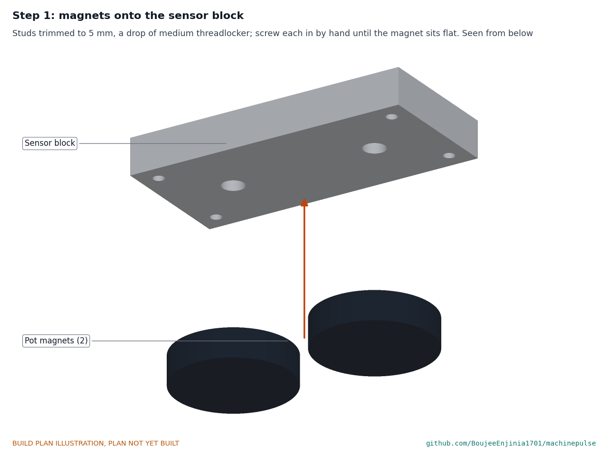

Seen from below. A drop of medium threadlocker on each trimmed stud; screw each magnet in by hand until its back sits flat on the block. Keep the magnets apart and away from steel tools while handling them.

### Step 2: boss onto the sensor block

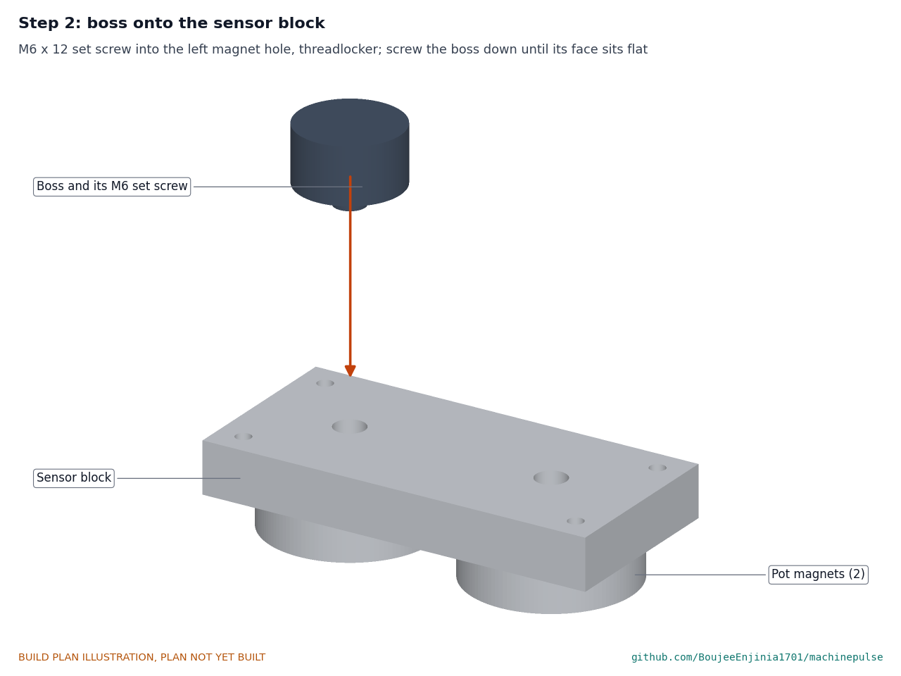

Threadlocker on the M6 x 12 set screw; screw it into the left magnet's hole from above until half of it stands proud, then screw the boss down onto it until the boss's face sits flat on the block.

### Step 3: glands and grommet into the box base

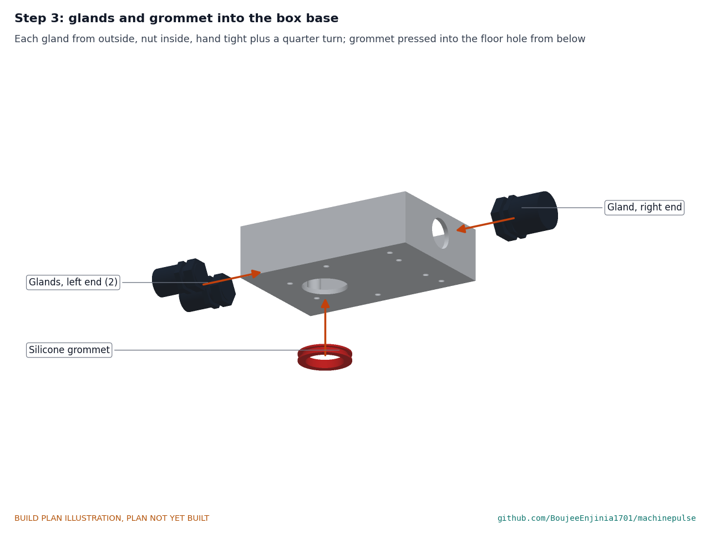

Each gland from outside with its nut inside, hand tight plus a quarter turn. Press the grommet into the boss hole from below until a flange sits each side of the floor.

### Step 4: box base onto the sensor block

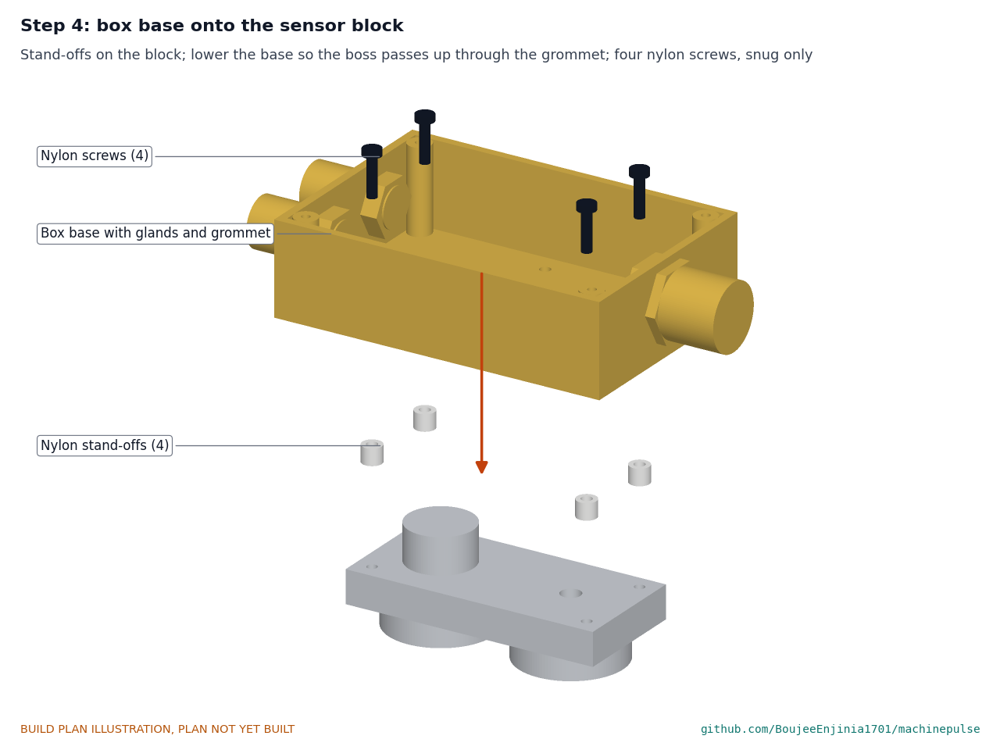

Stand the four nylon stand-offs on the block over their holes. Lower the base so the boss rises through the grommet and the floor sits on the stand-offs. Four nylon screws from inside, snug only: nylon threads strip easily. **Hold point:** the boss turns nowhere against the floor, and the 5 mm gap under the floor is even all round.

### Step 5: accelerometer onto the boss

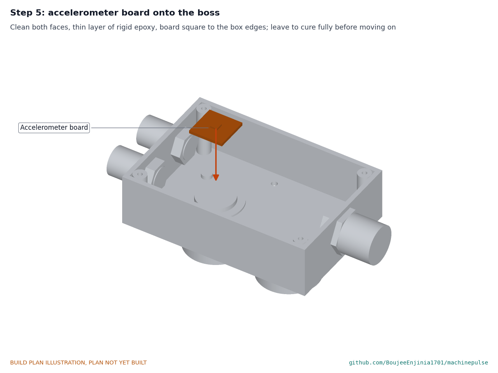

Clean the boss top and the board's underside, spread a thin layer of rigid epoxy, and set the board square to the box edges with its wires toward the carrier side. Leave it to cure fully before going on.

### Step 6: build the carrier board

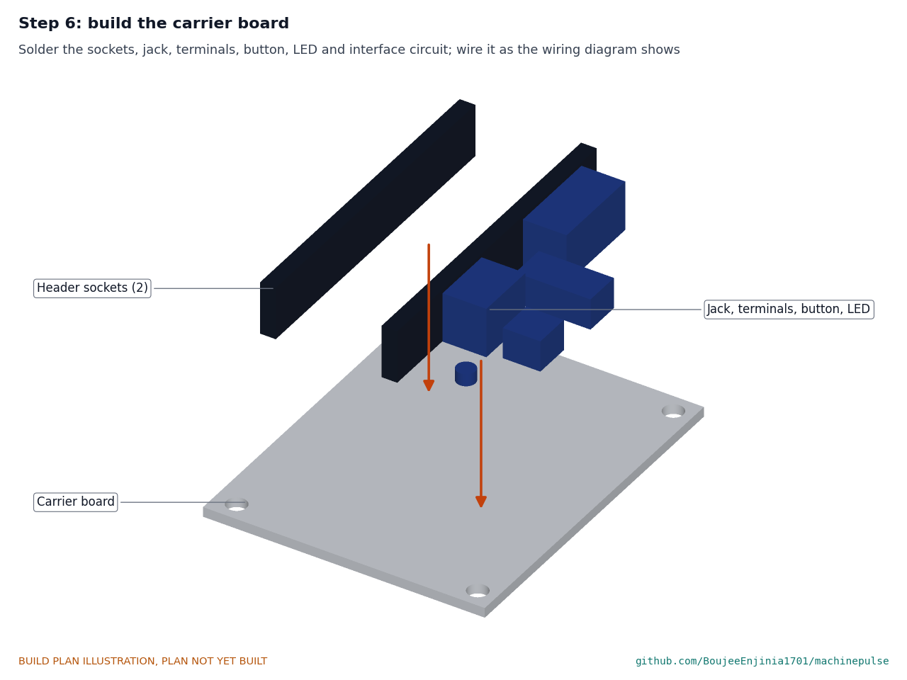

Solder the sockets, jack, terminals, button, LED and interface circuit as section 3.4 describes. **Hold point:** the checks of section 3.4 pass before the board goes in.

### Step 7: carrier stand-offs onto the floor

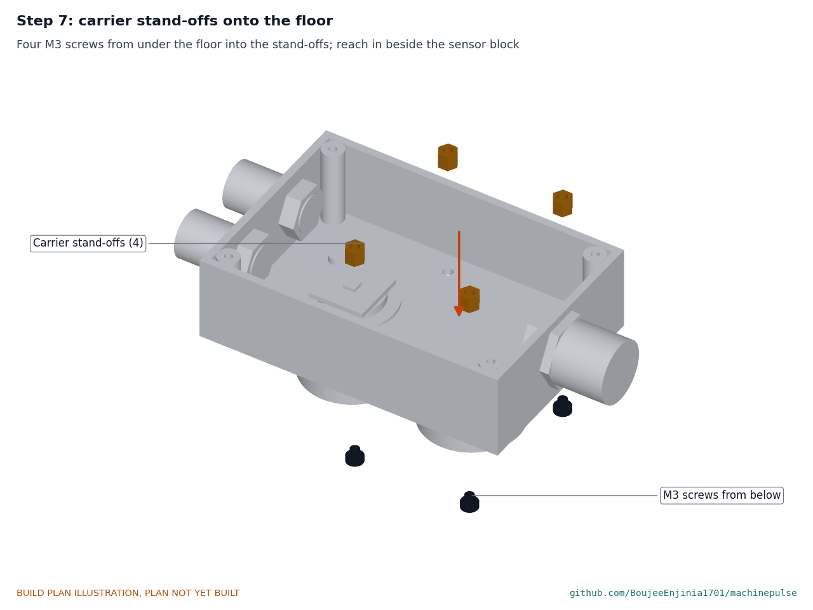

One M3 screw each from under the floor into the stand-offs, reaching in beside the sensor block.

### Step 8: carrier board onto its stand-offs

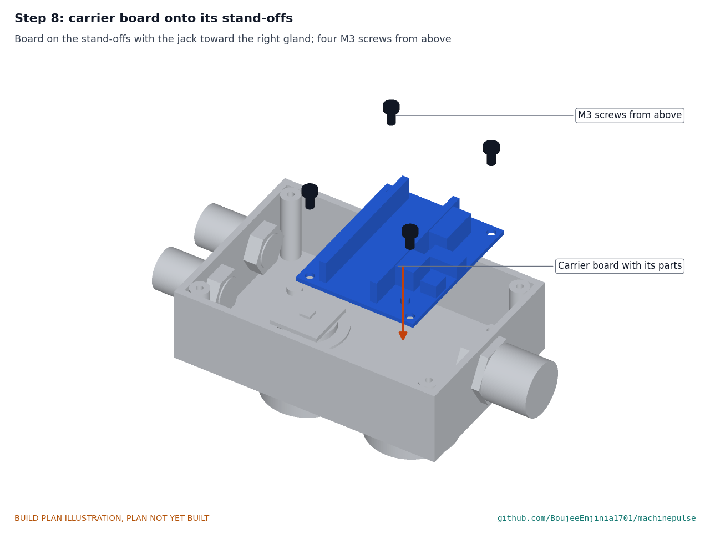

Board on the stand-offs with the jack toward the right gland; four M3 screws from above.

### Step 9: controller into its sockets

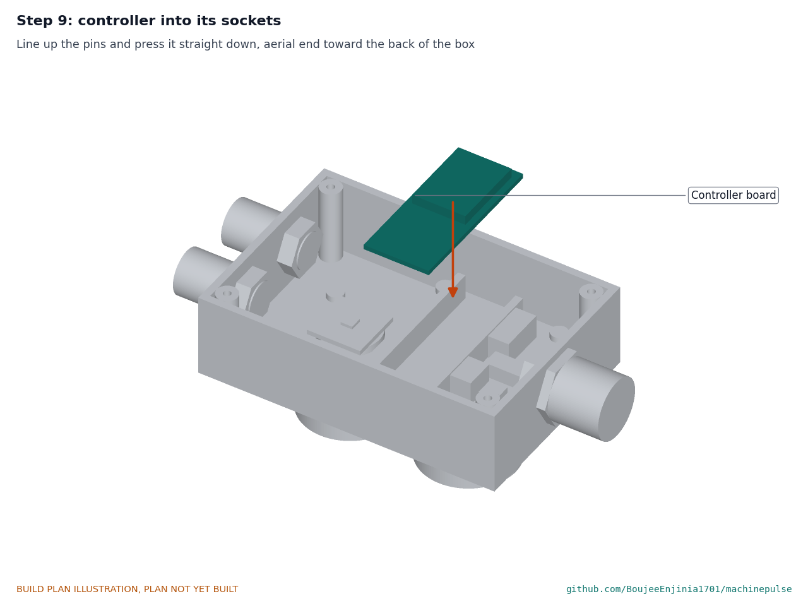

Line up the pins and press the controller straight down, aerial end toward the back of the box. Its USB port can be reached with the lid off.

### Step 10: leads in, light pipe and lid

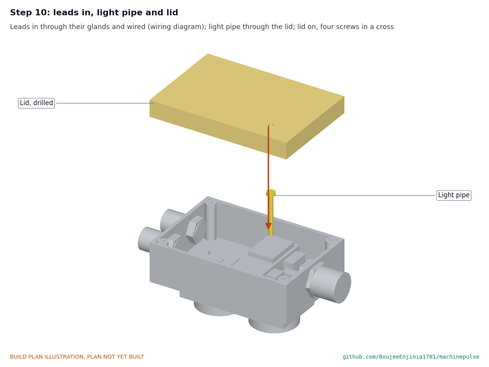

Pass the power, probe and current transformer leads through their glands and wire them as section 3.4.1. Tighten each gland cap on its lead. Fit the light pipe through the lid, seal its bezel, then close the lid with its four screws in a cross pattern. **Hold point:** safety stop S2.

### Step 11: magnets into the probe clip

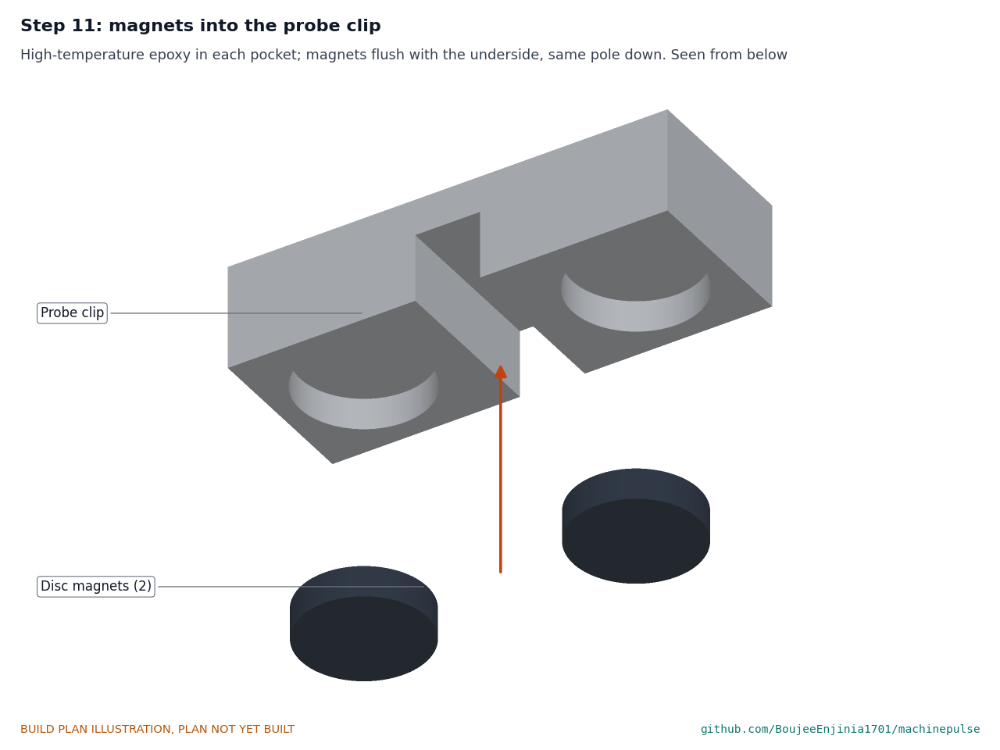

Seen from below. High-temperature epoxy in each pocket; press each magnet in flush with the underside, the same pole facing down on both. Leave to cure.

### Step 12: probe and pad into the clip

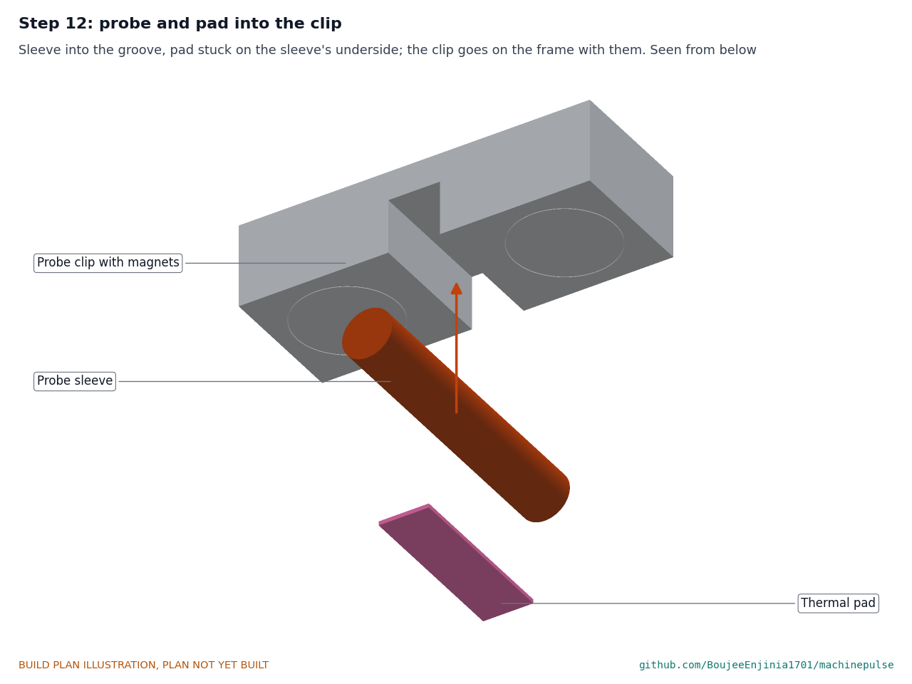

Seen from below. Stick the thermal pad on the sleeve's underside and lay the sleeve in the groove; the clip, sleeve and pad go onto the frame together.

### Step 13: onto the machine

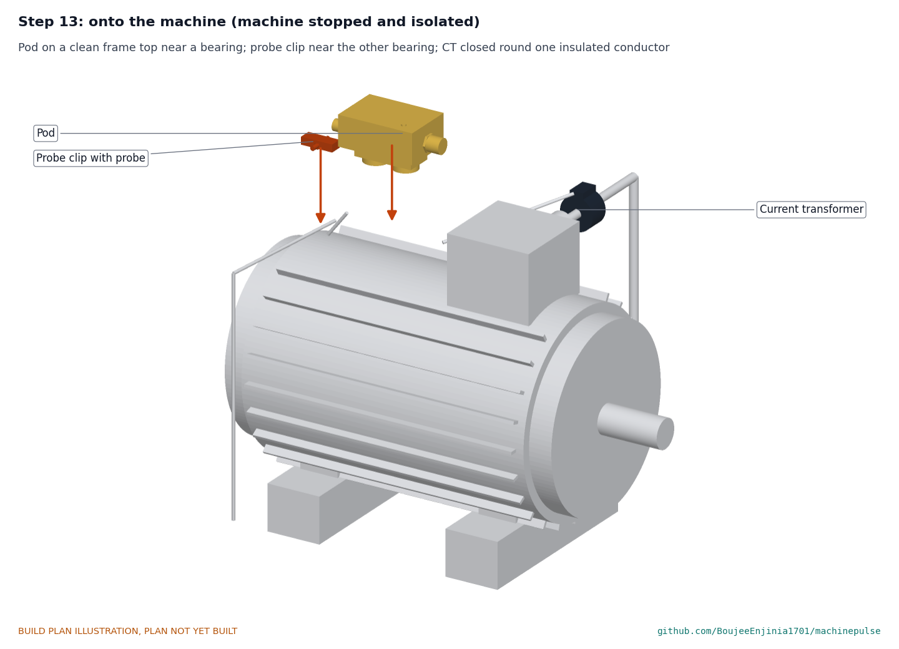

**Hold point:** safety stops S3 and S4. With the machine stopped, isolated and locked off: wipe a flat or gently curved patch of the frame top near a bearing and set the pod on it (on an aluminium frame, epoxy the two steel pads on first); set the probe clip near the other bearing; have a qualified person close the current transformer round one insulated phase conductor. Tie every lead clear of belts, shafts, chucks and fans.

## 5. First checks

These are the checks a TRL 4 test report would record; this plan only lists them. Requirement numbers are those of MPL-REQ-001.

*Table 2. First checks.*

| Check | Requirement | How | Pass when |
| --- | --- | --- | --- |
| Floor clear of the block | R12, R5 | Feeler gauge round the floor's edge; push the box sideways by hand | Gap 5 mm, give or take 0.5, all round; the boss touches only the grommet |
| Boss and magnets tight | R5 | Try to turn the boss and each magnet by hand | Nothing moves |
| Glands and lid sealed | R13 | Look at each seal on its lead; lid gasket evenly squeezed | No gaps; each lead cannot be pulled through its gland (the IP test comes later) |
| First power | R17 | Adapter plugged in; measure at the 5 V terminal and the 3.3 V pin; read the adapter current with a USB meter | 5 V give or take 0.25 V; 3.3 V give or take 0.1 V; about 85 mA |
| Current transformer bias | R3 | Current transformer unplugged; measure at the controller's analog input | 1.50 V give or take 0.03 V |
| Accelerometer at rest | R5, R6 | Pod flat on a steel plate; read the sensor | About 1 g on the vertical axis, about 0 on the others |
| Probe reading | R8 | Probe clip on a steel plate at room temperature beside a reference thermometer | Within 0.5 °C |
| Magnet hold | R11 | Pod on a painted steel plate; push it sideways by hand | It does not slide |
| Data reaches the broker | R9, R14 | Summary messages on the local MQTT broker | One a minute, each within 2 minutes |
| Mass | R11 (load) | Weigh the pod | About 0.32 kg |

## 6. Safety stops

Stop at each point. Carry on only when everything listed is true.

- **S1. Before the first power-up.** The adapter is a certified unit with the local safety mark and undamaged; on the carrier, 5 V and ground read open to each other; the 5 V terminal's polarity is checked with a meter, not by wire colour.
- **S2. Before the pod leaves the bench.** The first checks of section 5 that can be done on the bench pass; every gland is tight on its lead; the lid is closed and sealed.
- **S3. Before going near the machine.** The machine is stopped, isolated and locked off by the person responsible for it, and the lock-off is tested. The frame is cool enough to touch, or gloves are worn. Nobody near the work has a pacemaker.
- **S4. Before the current transformer is fitted.** It is a voltage-output type (its label shows a voltage output, such as 1 V at rated current). The conductor is single, insulated and undamaged. Any terminal box or panel is opened and closed only by a qualified person, and its cover is back on before the machine is restarted.
- **S5. Before the machine runs again.** Every lead is tied clear of belts, shafts, chucks and fans; no guard was removed or left open; the pod and probe are on stationary parts of the frame. MachinePulse is a monitoring aid only: it is never wired into the machine's controls.

## 7. Tools, skills and workspace

**Tools.** Hacksaw with a 24 teeth per inch blade; bench vice with soft jaws; V-block; drill press; drills 2.5 to 12 mm, a 5.0 mm drill and a flat-bottomed 12 mm drill or end mill; step drill to 24 mm; M3 and M6 taps with a tap wrench; flat and half-round files; small chisel; deburring tool; scriber, engineer's square, steel rule, calipers and feeler gauges; soldering iron and solder; wire strippers and ferrule crimper; multimeter; USB power meter; torque-limited or small screwdrivers; gloves for epoxy; kitchen scale to 1 kg; a flat steel plate for checks.

**Skills.** No certified trade is needed for the pod. Basic metalwork (marking out, sawing, filing, drilling, tapping), through-hole soldering on perfboard and careful handling of strong magnets. Fitting the current transformer at a machine is a qualified person's job wherever a terminal box or panel must be opened.

**Workspace.** A bench about 1.2 x 0.6 m; a metalwork corner kept apart from the electronics so chips stay off the boards; a ventilated place for epoxy and soldering; a non-magnetic tray for the magnets.

**Personal protective equipment.** Safety glasses for cutting, drilling and soldering; gloves for epoxy and hot frames; no gloves near a turning drill.

## 8. Where the numbers come from

- Model and constructability checks: `cad/src/model.py` (`python cad/src/model.py --check`, 102 checks); STEP and STL exports in `cad/step/` and `cad/stl/`.
- Pictures: `cad/src/build_plan_media.py`, using `.kit/build_views.py`; written to `docs/05-build-plan/` and `cad/drawings/MPL-DWG-101` to `MPL-DWG-106`.
- General arrangement: `cad/drawings/MPL-DWG-001.pdf`, Rev P4.
- Calculations: `docs/04-calcs/01-sizing.md` (MPL-CAL-001 v0.3) and `docs/04-calcs/sizing.py`; mass [D6], mount resonance [D7], magnet holding [E3], [E5], probe contact [F1], hot frame [G2], [G3], power [H1], cost [J1].
- Bill of materials: `bom/bom.csv` and `bom/bom-notes.md`.
- Decisions: `docs/decisions/0003-design-for-construction.md` (MPL-DDR-003), with MPL-DDR-001 and MPL-DDR-002; open items in `docs/06-design-decisions.md` (MPL-DEC-001).
- Requirements: `docs/03-requirements.md` (MPL-REQ-001 v0.5).
